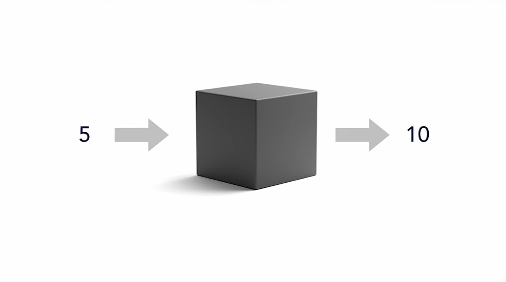
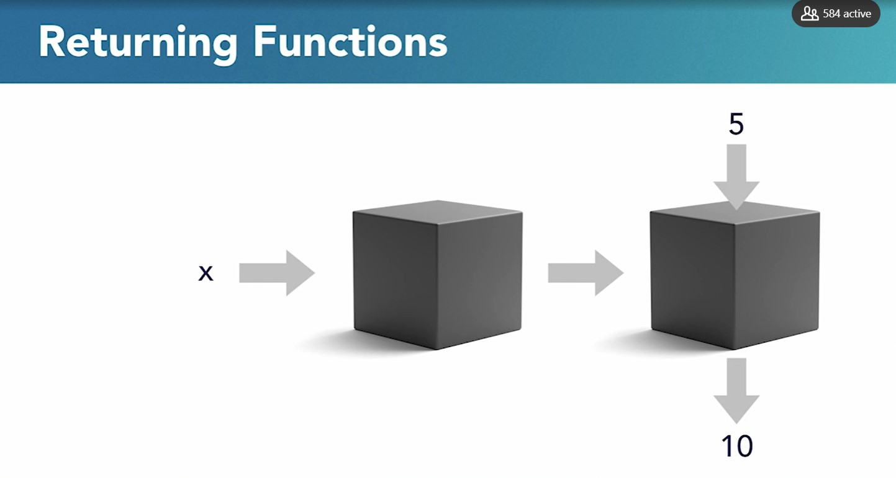
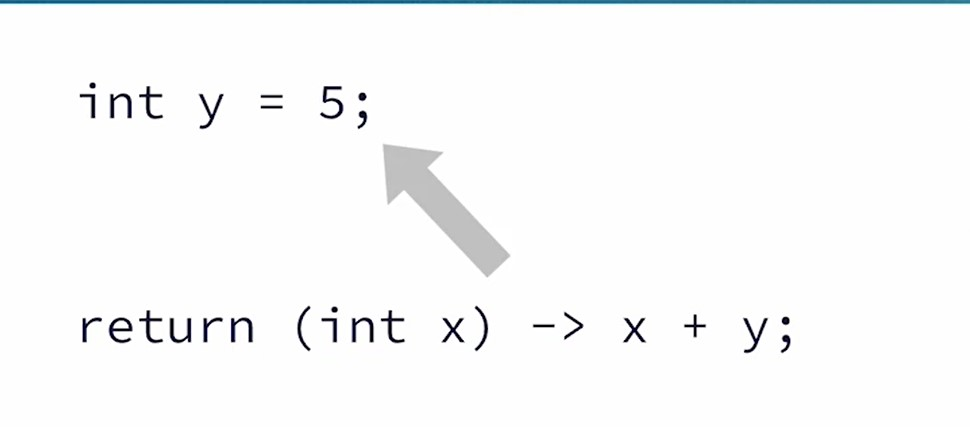
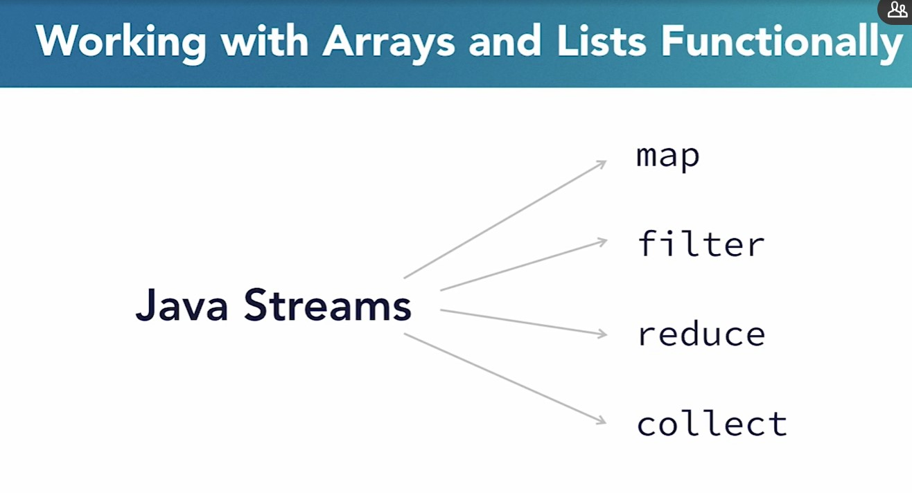
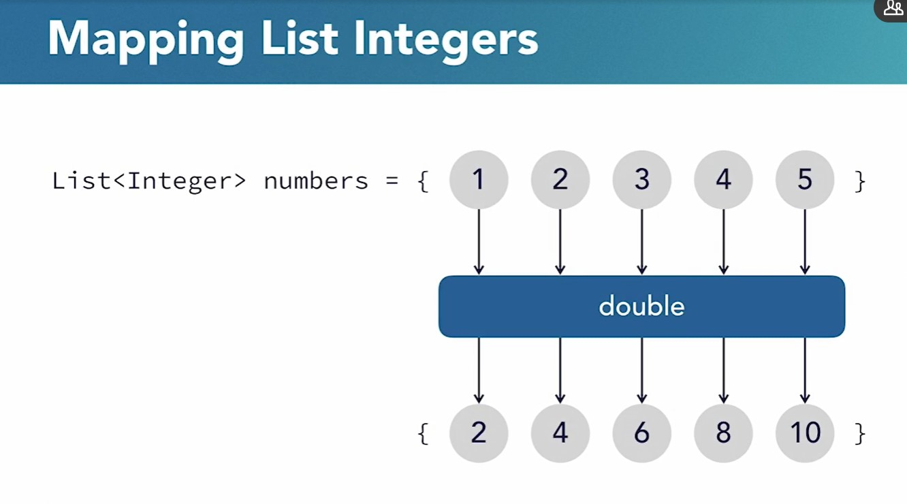
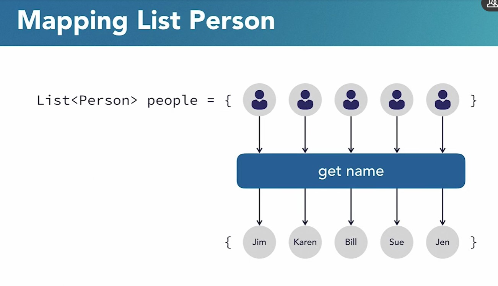
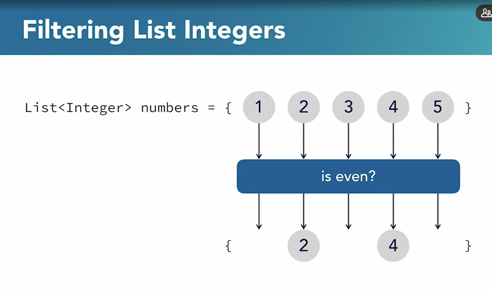
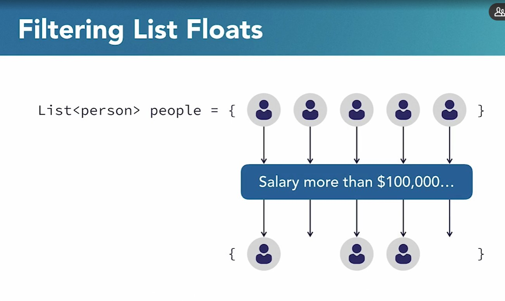
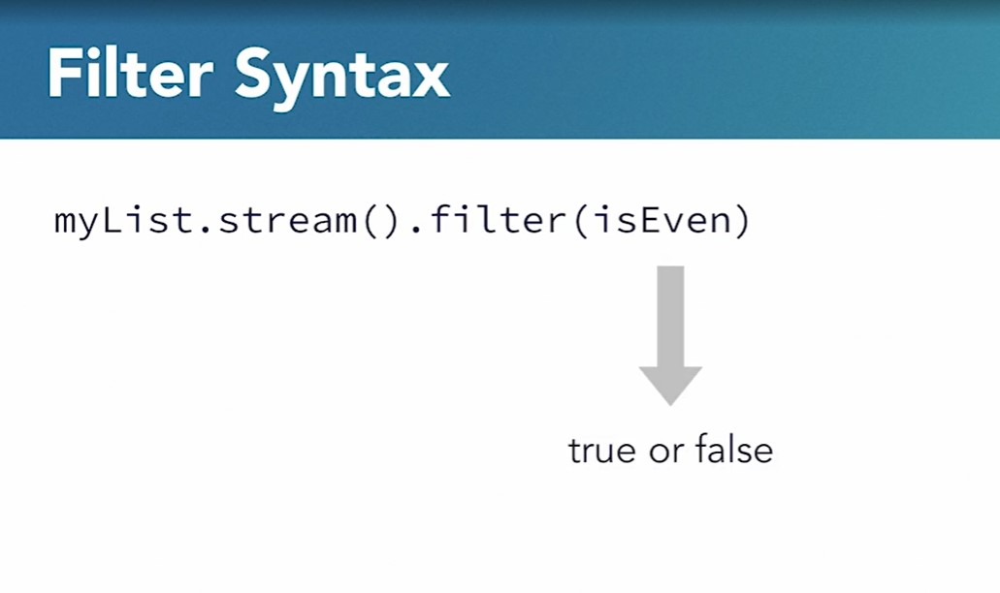
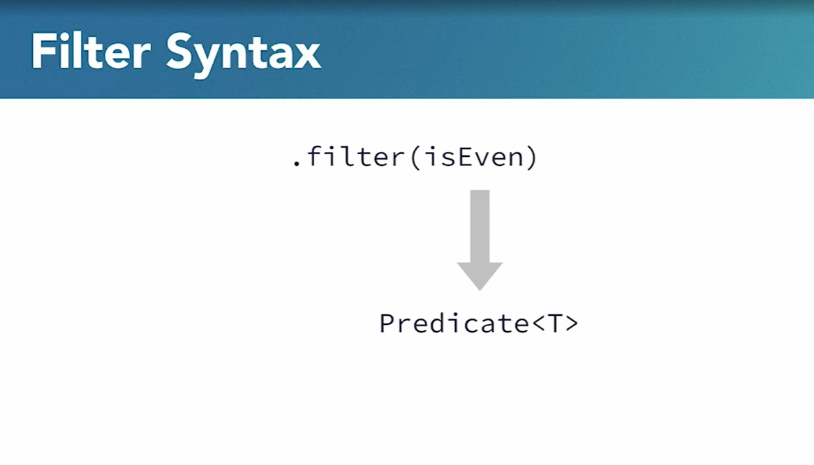

# Functional Programming with Java
This is the repository for the LinkedIn Learning course [Functional Programming with Java](https://www.linkedin.com/learning/functional-programming-with-java).

[Materials provided by Instructor](resources/instructor-materials/Ex_Files_Functional_Prog_Java.zip).

## Course details
Functional programming is a way of organizing code that makes applications more scalable and maintainable. By utilizing the core concepts of immutability, data-function separation, and first-class functions, programmers can write better code. In this course, learn about the functional programming paradigm and see how to take advantage of it with Java and object-oriented programming. Apply the learnings to real-world code and examine some of the more advanced and misunderstood concepts such as partial-application, recursion, and composition to become skilled in developing flexible code.

## 1. Introduction to Functional Programming
### 1.1 Why use functional programming?
* Functional Programming Misconception
    * Functional Programming and Object-Oriented Programming are not opposite. They can be used alongside each other.
    * Basically, there are just a few key places where Object-Oriented programming falls short or doesn't provide much guidance, and it is precisely in these areas that functional programming can step in and help.
* Where exactly does Object-Oriented programming falls short then?
    * When programs get larger and more complex, certain bugs start to show up that are difficult to track down and fix. 
        1. Partly because they are hard to recreate. 
        2. And partly because even when you figure out how to create them, it is next to impossible for you to keep track of all the changes that occur while the program is running.
    * In a typical enterprise-sized program, thousands of different variables are being operated on in thousands of different places at runtime, and the application can get itself into buggy states which can be difficult to recreate.
    * This is exactly the type of situation that functional programming aims to avoid.
    * At its core, functional programming is concerned with helping us take the large number of complex ideas in any large computer program and organize them in a coherent way while at the same time making sure the code remain easy to test and modify.
    * Functional programming brings the precision of mathematical functions into computer programs. 
    * Imagine if we were able to represent all parts of a computer program as simply as a mathematical function such as this one here, $f(x) = x + 1$. Where could a bug possibly be hiding in a function like this? 

### 1.2 What is declarative programming?
* Functional Programming is a declaritive style of programming. This is in contrast to other styles like object-oriented programming and procedural programming which are generally imperative style of programming.
    * **Imperative Programming**: Focus on how to do things.
    * **Declarative Programming**: Puts more focus on what things are.
* Imperative vs. Declarative:

    Imperative: How | Declarative: What |
    ----------------|-------------------|
    a. Set $x$ equals to zero<br>b. Add the first number in the array to $x$<br>c. Repeat step 2 for the rest of the numbers in the array<br>d. Divide $x$ by the length of the array.| $x$ is the sum of all the numbers in the array, divided by the length of the array.
* Core Concepts of Functional Programming
    1. Immutability
    2. Functional purity
    3. First-Class functions

### 1.3 Immutability in Functional Programming
* **Immutability** is the first major concept of Functional Programming.
* Typically, programmers assign a value to a variable. For example, we can define a variable called _X_ and store the value five in it `int x = 5;`, and then later on in the program, we can change the value of that variable to some completely different number `x = 100`, and later on, we can change its value again `x = -1` and so on, so forth.

* However, in Functional Programming, **this is actually not allowed**. When we say that `int x = 5;`, we mean for the rest of the program, X will only ever be 5. There is no way we can change it.
* In short, immutability means that we need to treat most of the values in a program as constants, and this can either mean that we use Java's `final` (i.e. `final int x = 5;`) keyword to make sure that we don't change a given value, or we can simply learn to write our code in a such way that our programs don't have any modifications.
* Another wat to think about **immutability** in functional programming is this:
    * In **Imperative Programming**: we generally treat variables as these buckets that we can put values into, and we call this **assigning values to variables**.
    * In **Functional Programming**: We don't _assign_ so much as **define** so when we say `int x = 3;`, we don't mean that `x` is just a container that's holding the value 3 currently, we literally mean that **`x` is another name for 3**. `x` is 3 in the same way that $pi$ is 3.14159, et cetera.
* So Functional Programming treats all values as if they were as concrete and unchanging as $pi$ or any other mathematical constant. Let's take a look at quick example:  
    * Let's assume in a program, we have an employee and we want to raise their salary?  
    * In Oject-Oriented programming, we could just change it directly, usually by calling a member function.
        ```
        Employee employee1 = new Employee('John', 60000);
        employee1.setSalary(70000);
        ```
    * In Functional Programming, on the other hand, we would instead define a new employee that represents the updated data and then use this new employee in our future calculations.
        ```
        Employee employee1 = new Employee('John', 60000);
        Employee updatedEmployee1 = new Employee('John', 70000);
        ```
* So the advantage of immutability and the reason that functional programming places such an emphasis on it is that it frees us from having to deal with something called **state change**. 
* **State Change**: When a program contains many variables that are all constantly changing at different times, it can be very hard to know what a state a program is going to be in at any given point in time, and as programs increase in size to include thousands or even millions of variables, this can lead to exteremly hard to find bugs and overall fragile code base that programmers are afraid to make changes to.

* Such a program that even test-driven development can't solve completely, since the task of testing all possible states that a program might get itself into is really impossible in programs of considerable size.
* Now, on the other hand, functional programming starts off with an immutable set of data as a single source of truth. That't the bottom line here, and then it uses functions to combine this data piece by piece and transform it into useful information, and this data is usually retrieved from a database or some other memory storage. 

* And there are 2 powerful advantages for this approach:
    1. Original data in a program will always remain intact, which makes bugs a lot easier to find. 
    2. Program constructed in this way are much easier to keep track of, since we can focus on any given piece individually.
    The only thing that determines the output of a given piece is the input. We don't have to think about the entire system all the time
#### Conclusion
In Functional Programming, we need to treat all data as immutable.


### 1.4 Functional Purity
* **Pure Functions**: Always return the same output for the same input.
* In Functional Programming, we aim to make all functions into pure functions.
* **Impure Functions**: Have an internal or external state change.
* The most common example of Impure Functions in Java is when you have a methods in a class they are rerferred to a mutable member variable.
* **Impure Function** example: 
    * Let's say we have a _Person_ class:
        ```
        public class Person {
            private int age;
            public int getAge() {
                return age;
            }

            public void setAgte(int age) {
                this.age = age;
            }
        }
        ```
    * This `getAge` function is probably not pure and here's why:
        ```
        // let's say it will return 34 because this is the person's age now
        person.getAge(); // --> 34
        
        // then we can change the person's age using setter method
        person.setAge(50); 

        // now when calling this metod again, it will give us different output
        // even though we called it using the same args again (no arguments)
        person.getAge(); // --> 50
        ```
* **Pure Function** example:
    * Basically Pure Function will take all the data that it needs to operate on as arguments or define that data inside its function body.
        ```
        // This function is pure since at runtime, 
        // there is no way to change the finction's output 
        // without changing the arguments that we pass to it.
        int add(int x, int y) {
            return x + y;
        }
        ```
* Does this mean we can't use member variables?
    * The answer to this: Not necessarily, provided we follow the previous concept of Immutability.
    * Again, let's assume the _Person_ class:
        ```
        public class Person {
            private String name;
            private int age;

            // if we have setters methods for the class member variables
            public void setName(String name) { this.name = name; }
            public void setAge(String age) { this.age = age; }


            // then our toString method is not pure,
            // since we could change its output 
            // by simply changing the value(s) of the member variable(s) 
            public String toString() {
                return "name: " + this.name + "age: " + this.age;
            }
        }
        ```
        However, if our _Person_ class does not allow us to change these variables, either by simply not changing them in any of the available methods or by declaring them `final`, the we can consider the `toString` method as pure.
        ```
        public class Person {
            private final String name;
            private final int age;

            // our toString method is pure,
            // since for a given Person instance, 
            // there's no way that we can change the output of
            // this method between successive calls. 
            public String toString() {
                return "name: " + this.name + "age: " + this.age;
            }
        }
        ```
### 1.5 First-Class functions
* The third core concept is **First-class functions**. This is where the power and flexibilty of Functional Programming really start to shine through.
* In Object-Oriented programming, we generally treat _data_ and _functions_ as entirely different types of entities. We never think of:
    * Creating an array of functions.
    * Passing functions as arguments to other functions.
    * Returning functions from other functions.
* On the other hand, in Functionl Programming, it is not only possible to do these things, it is in fact a source of tremendous flexibility.
* In Java, Firs-Class functions are done using the `Function` interface, which allows us to work with functions in a very similar ways to how we normally treat other objects or values.
    ```
    Function<T, R>
    ```
* This simple change in mindset towards functions:
    * Improves flexibilty and code reuse.
    * Allows us to do useful things like combining existing functions to create new functions.
        ```
        Function[] functionArray = {
            myFunction1, 
            myFunction2,
            ...
        };

        doSomething(myFunction);

        ...
        return someFunction;
        ```

## 2. First-Class Functions
### 2.1 The Function Interface
* In Functional Programming, we treat functions in a very similar way to other types such as Strings, integers, objects, or any other type in Java.
* In Functional Programming, we are allowed to assign functions to variables.
* Typically, we define functions as methods of a class. So as an example, if we have a _Person_ class, we might have getter and setter methods that interact with the class member variables.
    ```
    public class Person {
        public String getName() { ... }

        public void setAge(int newAge) { ... }
    }
    ```
* So our first step into First-Class functions then is going to be the fact that Java provides a function interface that allows us to define functions as variables.
    ```
    Function<T, R>
    ```
* Basically, this interface allows us to assign functions to variables and work with them in a very similar way to how we would work with any other data type.
* Code example can be found [here](functional-programming/src/main/java/com/example/chapter2/video1).

### 2.2 Lambda Expressions
* Beside creating references to other class's methods, the function interface allows us to create new functions from scratch.
* To this, Java provides us with a new piece of syntax called **Lambda Expressions**.
* Basically a lambda expression is a shorthand syntaxh that we can use to defein new functions without having to define these functinos without having to define these functions as methods of any given class. 
* Lambda expressions
    * Starts off with a set of parentheses, which contains whatever arguments the function will accept
    * Then they have an **arrow**.
    * The **arrow** is followed by whatever we want the return value of the function to be.
    * Note that when our lambda expression are only one line, we don't need to use the return keyword here, the value of the statement after the arrow is returned automatically.
        ```
        (Inteher someArgs) --> someArgs * 2 + 1;
        ```
    * Here we see an example of what it might look like to actually use a lambda expression to define the new function using the `Function` interface.
        ```
        Function<Integer, Integer> myFunction = (Integer someArgs) -> someArgs * 2 + 1;
        ```
    * When we define a new `Function` using the lambda expression, the types we provide in between the triangle brackets of the function interface have to match the types of the argmument and return values respectively.
    * Since we already supplied the type of the argumnet inside the triangle brackets, we don't even need to supply that again inside the parentheses of the lambda expression.
    * Another example where we have a function that takes a `String` as an argument and returns its length:
        ```
        Function<String, Integer> getStringLength = (myString) -> myString.length();
        ```
    * Another thing about the lambda syntax is that in the case where we have only **one** argument, we are allowed to drop the parentheses around that argument.
        ```
        Function<String, Integer> getStringLength = myString -> myString.length();
        ```
* Lambda Expressions: Multiline
    * It is possible to have lambda expressions with multiple lines. 
    * In that case we wrap the body of the expression in curly braces and use the `return` keyword on the last line.
* Code example can be found [here](functional-programming/src/main/java/com/example/chapter2/video2).

### 2.3 BiFunctions and beyond
* Can we use the `Function` interface to defein functions with different number of arguments?
    * The answer is **Yes**. When doing Functional Programming in Java, it is possible to work with functions that have any number of arguments. 
* The first thing we are going to look into is another functional programming interface in Java. This interface is called `BiFunction`.
    * Basically, the `BiFunction` interface is exactly like the `Function` interface, except it applies to functions that takes two arguments instead of one.
        ```
        BiFunction<T, U, R>
        ```
* How we deal with functions that have some number of arguments other than one or two?
    * In this case, Java doesn't provide any built in types such as tri-functions or quadr-functions and so on.
    * However, it is possible to define our own interfaces for these types of functions, and they will work just the same way as the `Function` and `BiFunction` interfaces.
    * It is recomended that the custom interfaces is annotated as `@FunctionalInterface`. The annotation make it illegal to have more than one function in the interface.
* Code example can be found [here](functional-programming/src/main/java/com/example/chapter2/video3).

### 2.4 Functions as data
* One thing that functional interfaces allow us to do is assign the definition of a function dynamically at runtime.
* Let' think about an example. 
    * Assume we are writing a program that loads data from a server (i.e. data about _Person_).
    * This process takes a long time and during development or while running tests.
    * Using the concept of functions as data, we can dynamically change the definition of the function that loads our data based on the environment it's running in.
* Code example can be found [here](functional-programming/src/main/java/com/example/chapter2/video4).

### 2.5 Passing functions as arguments
* Now we will look at how we can pass functions as arguments to other functions.
* We are used to functions like the below one where we specify what data the function will be operating on.
    ```
    int add(int x, int y) {
        return x + y;
    }
    ```
* Instead of passing arguments into our function to specify what our data is, we could pass arguments to specify what was done to that data.
* Code example can be found [here](functional-programming/src/main/java/com/example/chapter2/video5).

### 2.6 Returning Functions
* In programming, it's common to hear functions referred to as a _black box_. You put data in the box and you get some different data out.
    * If we're talking about a function called double for example, you put one number into the box, say five, and then we get another number out, in this case 10.
    
    * Since Java allows us to treat functions in the same way as any other data type, it's possible in Java to have a _black box_ that returns another _black box_. And this other _black box_ then behaves in the same way as a regular function, where we put data in, and then we get some different data out.
    

* What if instead of having to define several different functions with only slightly different definitions, we could just have a function that created these variations for us. Now, this is a job for first class functions. So what we're picturing here is a function that takes a number as an argument and returns another function that multiplies its own integer argument by whatever number we originally passed to the outer function
* Code example can be found [here](functional-programming/src/main/java/com/example/chapter2/video6).

### 2.7 Closure
* Returning functions from other functions leads us to another very important concept in Java, and this is something called closure.
* Closure means that when we define a function that returns another function, the function that we return still has access to the internal scope of the function that returned it.

* Code example can be found [here](functional-programming/src/main/java/com/example/chapter2/video7).

### 2.8 Higher-order functions
* **Higher Order Functions**: Functions that either take other functions as arguments or return other functions.
* Code example can be found [here](functional-programming/src/main/java/com/example/chapter2/video8).

## 3. Working with Streams in Java
* Many concepts of Functional Programming have a great deal of native support in the Java language itself.
* Through its **Stream** interface, Java provides a host of built in functions and functionality that makes working with arrays and other similar structures, such as lists in a functional way, incredibly easy.
* Built-in functions such as `map`, `filter`, `reduce` and `collect`, make the formerly complicated task of transforming lists data almost trivial.


### 3.1 Map in Java
* `map` is a built-in function that can be used convert each of the individual elements in the list to other form.
* Examples:
    * We have a list of numbers and we want to double all the numbers in the list.
    
    * We want to convert a list of inch measurements into a list of centimeter measurements.
    
    * We have a list of person objects with name, age, and job attributes, and maybe a lot more data as well. And we want to convert this data into a list that contains only the people's names.
    
* The typical procedural way to do this would be is to:
    * use a `for` loop to loop through all the elements in an array and push modified elements onto a new array.
        ```
        List<Integer> doubled = new ArrayList<Integer>();
        for(int i = 0; i < numbers.size(); i++) {
            Integer result = numbers.get(i) * 2 ;
            doubled.add(result);
        }
        ```
    * Or worse, simply modify the elements in place.
        ```
        List<Integer> doubled = new ArrayList<Integer>();
        for(int i = 0; i < numbers.size(); i++) {
            Integer result = numbers.get(i) * 2 ;
            numbers.set(i, result);
        }
        ```
    * This way can very easily lead to bugs, especially as the body of the for loop gets bigger and more complex.
* Java provides a much easier, cleaner and more functional way of doing this using its built-in map function.
* Streams in Java:
    * `map`, and the same applies to other functions, only works with Streams. So we need to convert the list, array or any other data structure to a Stream.
    * Streams in Java basically take some data structre such as a list and they allow us to process the data in pipelined way.
    * There are several ways to convert Java data structures into streams.
    * The easiest way is to use a list to store our data and then simply call the `.stream` method on that list, which creates a Java stream with that list as an input.
        ```
        myList.stream();
        ```
    * Once we've converted our data structure into a stream, the way we use `map` is by calling it on that stream and passing it a function object that we want to apply to each element in the stream.
        ```
        myList.stream().map(timesTwo);
        ```
* Important Note about Streams:
    * Map and other stream functions do not mutate the original lists they are called on.
    * Since each call to `map` or `filter` returns another stream, at some point we're going to want to convert this stream into a list that contains the final data. And to do this, all we have to do is to call the `.collect` method.
        ```
        myList.stream()
            .map(timesTwo)
            .collect(Collectors.toList());
        ```
* Code example can be found [here](functional-programming/src/main/java/com/example/chapter3/video1).

## 3.2 Filter in Java
* `filter` is used when you want to find all the elements in an array or list that fit some kind of criteria.
* For Example:
    * If we have a list of numbers and we want to get all the numbers from it that are even.
    
    * If we have a list of employee objects, and we want to find the employees from this list that make more than a certain amount per year.
    
* `filter` syntax:
    * The syntax of filter is similar to `map`.
        ```
        myList.stream().filter(isEven);
        ```
    * We convert our list data into a stream, and then we can call the filter function with a function object as an argument.
    * The main difference between `filter` and `map` is the type of function that we pass to it.
    * With `map`, we pass in a function that returns a value for each element in our stream. And the return value of this function represents what that element becomes after the element is processed.
    * On the other hand, for `filter`, we pass it a function that returns a `Boolean` that is either `true` or `false` for each element.
    * If the function we pass returns `true` for a given element, then that element is kept in the output stream. Otherwise it's left out.
    
    * While `map` expects a type `Function`, the `filter` method expects a function of type `Predicate`.
    * `Predicate` is Java built-in interface, similar to `Function`, that returns `Boolean`.
    
* Code example can be found [here](functional-programming/src/main/java/com/example/chapter3/video2).